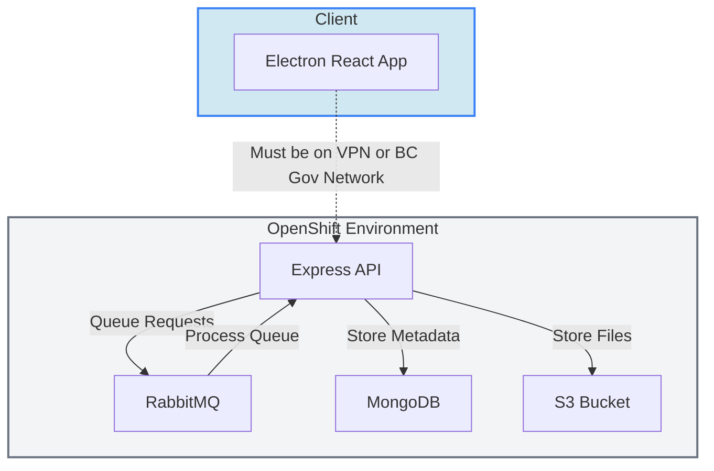

# Digital Archive Transfer Service - DATS

[](Redirect-URL)

The DATS project will be transferring inactive Full Retention (FR) government digital records and metadata to be archived, according to approved Information Schedules.

<br />

## Quick Start

1. **Set Up Environment**: Set up the `.env` based on the `.env.template` file.

2. **Start Services**: Run `npm run up` to start the API, MongoDB, and RabbitMQ services.

3. **Desktop Directory**: Navigate to `desktop`.

4. **Install Dependencies**: Run `npm install`.

5. **Build App**: Run `npm run build` to enable worker functionality.

6. **Launch App**: Run `npm run dev`.

### Next Steps

- [Change API URL](#change-api-url)
- [Test Desktop App Executable](#test-desktop-app-executable)
- [Publish Desktop App Updates](#publish-desktop-app-updates)
- [Worker Scripts](#worker-scripts)
- [VPN/BC Gov Network Requirement](#vpnbc-gov-network-requirement)
- [Architecture Diagram](#architecture-diagram)
- [Tech Stack](#tech-stack)
- [Key Files and Directories](#key-files-and-directories)

<br />

## Change API URL

To switch API environments:

1. In the app, go to `Developer > Select Environment`.

2. Choose `Local`, `Dev`, `Test`, or `Prod`.
  - Default: `Local` during development using `npm run dev`, `Prod` in executable builds.

<br />

## Test Desktop App Executable

1. **Clear Build Folders**: Remove `desktop/out/` and `desktop/dist/`.

2. **Build Executable**:

  - Run from `desktop/` as an Administrator:

```
npm run build:windows-latest
npm run build:macos-latest
npm run build:ubuntu-latest
```

3. **Locate Build**: In VSCode, right-click `desktop/dist/` and select `Reveal in Finder/File Explorer`. Run the setup executable.

4. **Test App Launch**: Ensure the desktop app opens correctly, then close it.

5. **Run in Console**:
    a. Windows: Open Command Prompt and run `<file-location>/DATS.exe`
        e.g., `C:\Users\<username>\AppData\Local\Programs\DATS\DATS.exe`
    b. Mac: Open Terminal and run `<file location>`
        e.g., `/Applications/DATS.app/Contents/MacOS/DATS`

<br />

## Publish Desktop App Updates

The desktop app will automatically look for updates every time it is started. It looks at the releases in this repo for newer versions. Details in `desktop/package.json` such as `version` and `build.publish` control the updates.

To create a new release, run the `Build and Publish Electron App` workflow under `Actions` in the repo and choose to update by a patch (y of 'x.x.y'), minor (y of 'x.y.x'), or major (y of 'y.x.x'). The workflow has an error in the last step but it still works.

<br />

## Worker Scripts

The desktop application utilizes worker scripts to collect metadata and copy files from the user's machine. They run on their own threads outside of the main application.

**IMPORTANT**: Every time changes are made to these workers, the app must be re-built.

The workers are found under `desktop\src\main\fileProcessing\workers`.

The `desktop\src\main\fileProcessing\WorkerPool.ts` controls how the workers are run, handling start up, messaging, and shutdown.

The `desktop\src\main\fileProcessing\actions` are functions that will run the worker scripts. These functions are called by events in the main process.

<br />

## VPN/BC Gov Network Requirement

Use of the application requires a connection to the BC Gov Network (directly or via vpn). 

In the desktop app we check for this every 5 seconds by calling `desktop\src\preload\api\checkIPRange.ts` from a useEffect in `desktop\src\renderer\src\App.tsx`. This checks the users IP list to find one of the allowed ip ranges from a list we got from https://ipinfo.io/AS3633 which gathers ip ranges for `gov.bc.ca`.

In OpenShift we block all requests from outside the ip ranges detailed above.

<br />

## Architecture Diagram



## Tech Stack

The Digital Archive Transfer Service (DATS) is built using the following technologies:

### Backend
- **Node.js**: The runtime environment for executing JavaScript code on the server.
- **Express.js**: A web application framework used to build the API.
- **MongoDB**: A NoSQL database used to store metadata and transfer records.
- **RabbitMQ**: A message broker used for queuing and processing transfer jobs.
- **Mongoose**: An Object Data Modeling (ODM) library for MongoDB, used to define schemas and interact with the database.
- **Zod**: A TypeScript-first schema validation library used for validating API request bodies.
- **PDFKit**: A library for generating PDF documents, used for creating submission agreements.
- **Unzipper**: A library for extracting zip files, used for processing transfer files.
- **Archiver**: A library for creating zip files, used for packaging transfer data.
- **ExcelJS**: A library for creating and manipulating Excel files, used for generating digital file lists.

### Frontend (Desktop Application)
- **Electron**: A framework for building cross-platform desktop applications using web technologies.
- **React**: A JavaScript library for building user interfaces.
- **Material-UI (MUI)**: A React component library for implementing consistent and accessible UI designs.
- **TypeScript**: A strongly typed programming language that builds on JavaScript, used across the project for type safety.


## Key Files and Directories

### Backend
- **`src/`**: Contains the source code for the backend services.
  - **`config/`**: Configuration files for environment variables, CORS, and rate limiting.
  - **`modules/`**: Contains modules for various backend functionalities, such as file list management, transfer handling, and authentication.
  - **`utils/`**: Utility functions for common tasks like logging, checksum generation, and date formatting.
- **`docker/`**: Docker configuration files for containerizing the backend.

### Desktop
- **`src/`**: Contains the source code for the desktop application.
  - **`main/`**: Main process scripts, including worker scripts for file processing.
  - **`preload/`**: Preload scripts for secure communication between the renderer and main processes.
  - **`renderer/`**: Frontend code for the Electron app, built with React and Material-UI.
- **`resources/`**: Contains static resources like icons and release notes.
- **`add-release-notes.js`**: Script for updating release notes.
- **`bump-version.js`**: Script for incrementing the app version.
- **`electron.vite.config.ts`**: Configuration for building the Electron app.
- **`cjs.workers.vite.config.ts`**: Configuration for building CommonJS worker scripts.
- **`es.workers.vite.config.ts`**: Configuration for building ESModule worker scripts.
